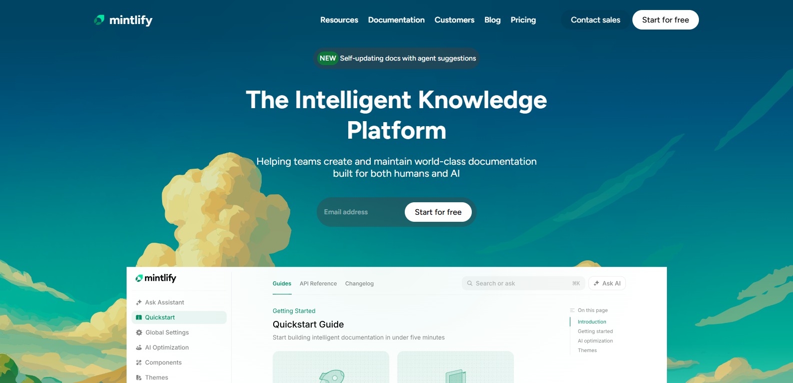
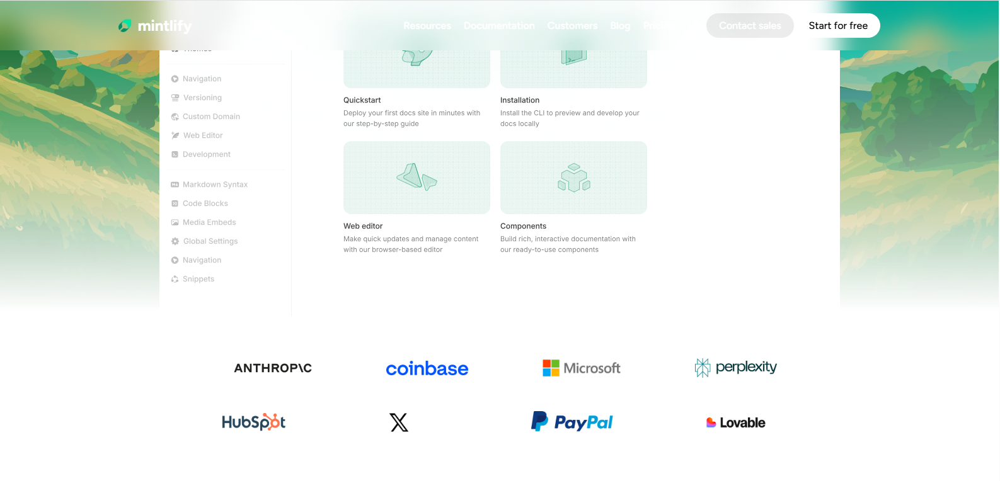
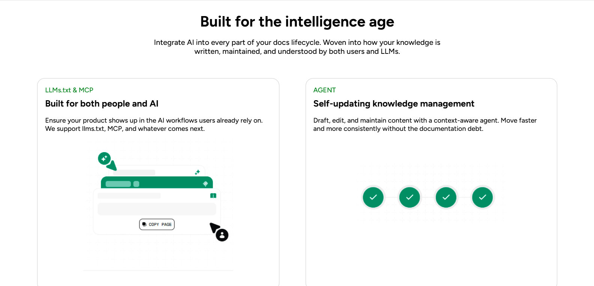
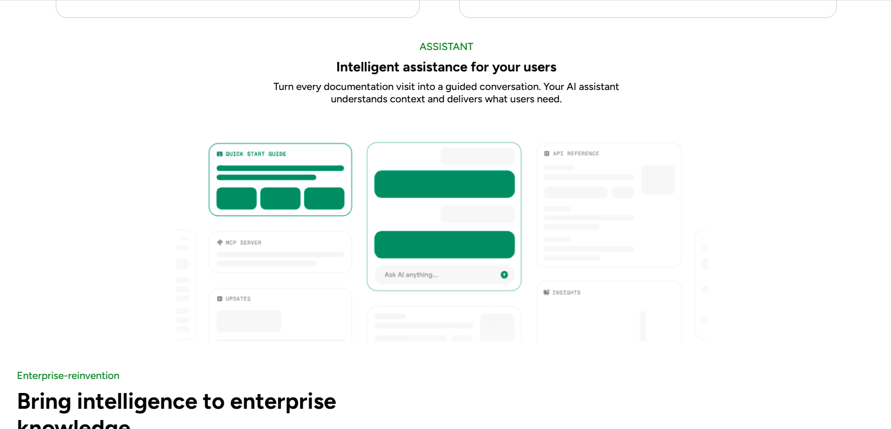
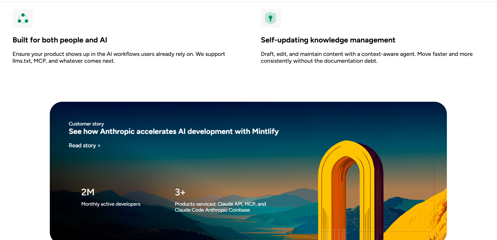
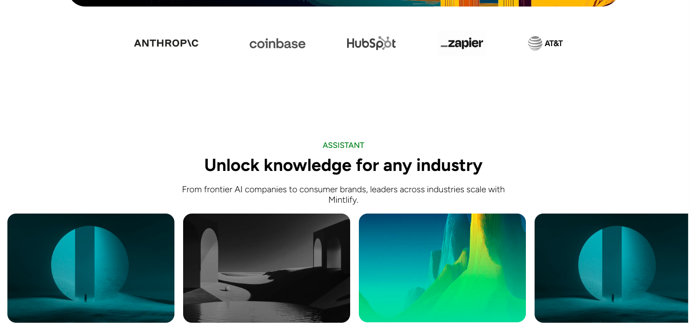
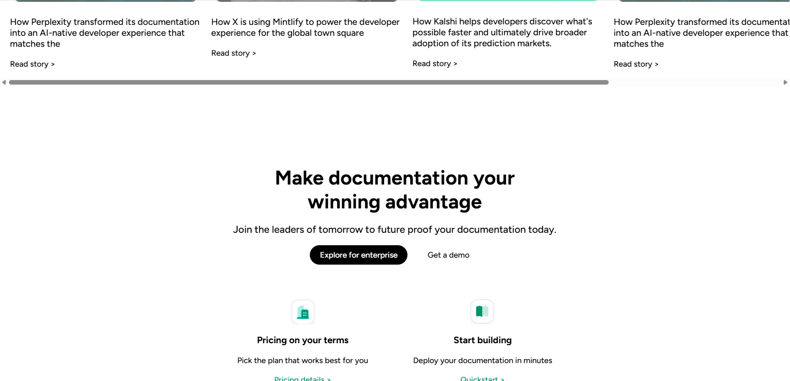
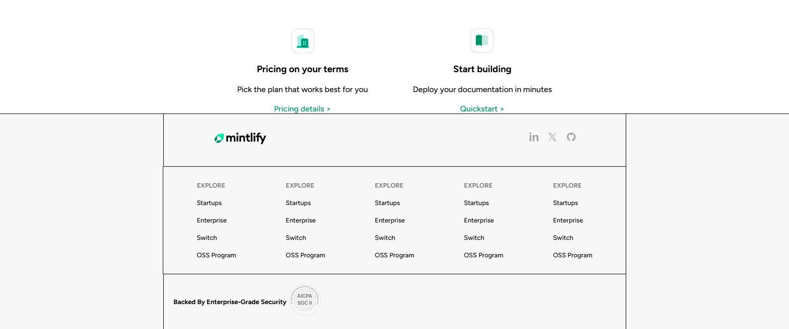

A modern **Mintlify website clone** built using pure **HTML & CSS**.  
This project is created for frontend practice and to improve UI development skills by replicating a real-world modern website.

---

- HTML5  
- CSS3  
- Flexbox  
 

---

## ✨ Features
- Clean and modern UI  
- Fully responsive layout  
- Reusable components  
- Optimized images and layout  
- Beginner-friendly structured code  

---

## 📸 Project Screenshots

### 🖥️ Home Page & Sections










---

## 📂 Project Setup
To run this project locally:

```bash
git clone https://github.com/your-username/Mintlify-clone.git

